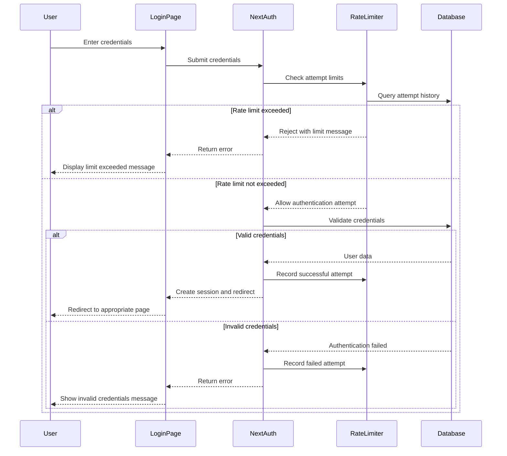
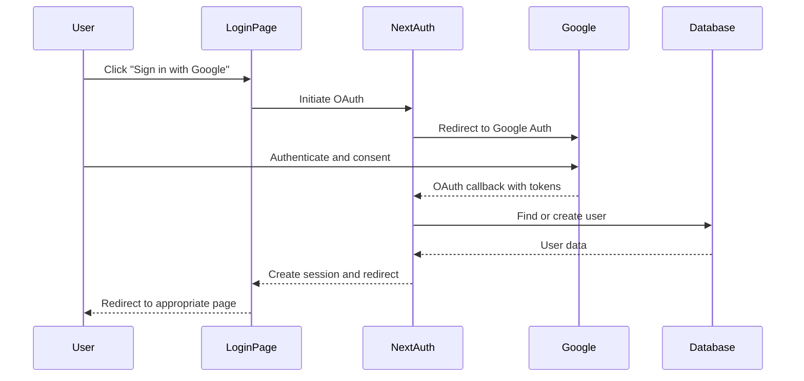

# Authentication Domain Documentation

## Overview

This document provides a comprehensive overview of the authentication system implemented in the Driving School Booking System. The system uses NextAuth.js for authentication, with support for both username/password credentials and Google OAuth, enhanced with security features such as rate limiting and JWT-based sessions.

## Architecture

The authentication system is built on the following components:

### Data Models

1. **User Model** (`src/models/User.ts`)
   - Stores user account information
   - Contains fields for credentials, profile data, and role information
   - Supports both local authentication and OAuth providers

2. **LoginAttempt Model** (`src/models/LoginAttempt.ts`)
   - Tracks authentication attempts
   - Records IP address, email, timestamp, and success status
   - Used for implementing rate limiting security

### Core Components

1. **NextAuth Configuration** (`src/app/api/auth/[...nextauth]/route.ts`)
   - Central authentication handler
   - Configures providers, callbacks, and session management
   - Implements authentication logic

2. **Login Rate Limiter** (`src/lib/utils/loginRateLimiter.ts`)
   - Provides utilities for managing login attempt limits
   - Tracks and enforces rate limiting per user/IP

3. **Login Page** (`src/app/login/page.tsx`)
   - Handles user interaction for authentication
   - Provides feedback on authentication status
   - Supports multiple authentication methods

## Authentication Flow

### 1. Login Process

### 2. Google OAuth Process

### 3. Session Management

After successful authentication:

1. NextAuth creates a JWT token containing user information
2. The token is stored as an HTTP-only cookie
3. The token is verified on each request
4. User role information in the token determines access rights
5. Sessions expire after 30 days by default

## Rate Limiting Implementation

### Configuration

- Maximum 5 login attempts per calendar day
- Attempts are reset at midnight (local time)
- Tracking is based on both email and IP address

### Workflow

1. When a login attempt is made, the system:
   - Extracts the user's IP address
   - Checks if the number of failed attempts for that email/IP combination has exceeded the limit
   - Proceeds with authentication if within limits
   - Returns a specific error if the limit is exceeded

2. For tracking attempts:
   - Failed attempts are recorded in the database
   - Successful attempts are also recorded for audit purposes
   - A query counts attempts since the start of the current day

3. When limits are exceeded:
   - The user receives a message indicating when they can try again
   - No further authentication attempts are processed
   - The limit automatically resets at midnight

## Security Considerations

### Password Security

- Passwords are hashed using bcrypt before storage
- Password comparison is done using constant-time comparison
- Original passwords are never stored in the database

### Session Security

- JWT tokens are signed with a server-side secret
- Cookies are HTTP-only to prevent client-side access
- Secure flag is enabled in production

### Rate Limiting Security

- Prevents brute force attacks by limiting attempt frequency
- Combines both email and IP tracking to prevent evasion techniques
- Provides informative error messages without leaking system details

## User Role Management

The system supports multiple user roles with different access levels:

- **User/Student**: Regular users who can book lessons
- **Instructor**: Can view and manage their assigned lessons
- **Admin**: Has full system access

Role-based redirection occurs after login, ensuring users access the appropriate areas.

## Error Handling

The authentication system includes robust error handling:

1. Invalid credentials: User-friendly error message
2. Rate limiting: Clear indication of attempt limits with reset time
3. OAuth errors: Graceful fallback and retry options
4. Session errors: Automatic redirection to login

## Integration Points

The authentication system integrates with:

1. **User Profile**: Redirects users to complete their profile if needed
2. **Role-Based Access Control**: Controls access to protected routes
3. **API Routes**: Secures backend endpoints
4. **UI Components**: Shows/hides elements based on authentication status

## Testing

Authentication flow can be tested through:

1. Manual testing of login/logout flows
2. Rate limit testing (requires multiple attempts)
3. Automated tests for authentication logic
4. Session persistence checks

## Troubleshooting

Common issues and solutions:

1. **Invalid credentials errors**: Verify email and password
2. **Rate limiting**: Wait until the next day or contact administrator
3. **Google authentication failures**: Check third-party cookies settings
4. **Session expiration**: Re-authenticate when prompted
